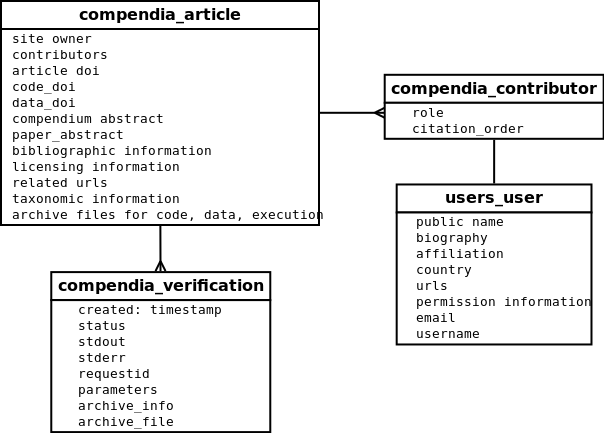

.. _project:

=================
Project Structure
=================

ResearchCompendia is a Django project that contains apps for organizing users and their compendia.
It also has the basic functionality provided by Django and many common Django packages.

* `compendia`: this handles the presentation and archiving of a research compendium.
* `api`: this handles our service apis.
* `lib`: this holds utilities that do not call for an app
* `home`: this handles the landing page, faq, and similar concerns that don't call for separate apps.
* `users`: this handles users and profiles

---------
Compendia
---------

For this prototype, we've started with a few simple models to represent research compendia and 
related metadata. Here are a few of the most salient models.

The starting point for a compendium is an Article. An Article contains high level information
about a compendium.

* reference information to the original material for use in citations
* a "code and data abstract" description
* links to archives of compendium materials such as code archives, data archives, and documentation
* link to archive of the *verification package*. This is only editable by admins.
* DOI for the original material as well as DOIs for the compendium materials.
* taxonomic information
* licenses for code and data

Articles with verification packages can be run via the verification service API. Each run of
an article results in a Verification record that links back to its Article.
Our prototype for now stores only a few fields. In the future,
ResearchCompendia will use `Sumatra <http://neuralensemble.org/sumatra/>`_
as a service and will consume serialized Sumatra records for each run. At which point we will
deprecate our own verification model.

---
API
---

^^^^^^^^^^^^^
/api/v1/dois/
^^^^^^^^^^^^^

This service accepts a json dictionary `{ 'doi': <doi> }` and performs a crossref
request to return a json dictionary corresponding to compendium attributes. This is
used on the compendium creation page to auto-populate values. I made it an API rather
than a part of the compendia creation view so that we wouldn't make the user wait
on the django framework for populating the form in the backend before returning it
to the template.

^^^^^^^^^^^^^^^^^^^^^^^^^^
/api/v1/verification/`id`/
^^^^^^^^^^^^^^^^^^^^^^^^^^

We have a primitive verification API implementation proof-of-concept that was done mostly to test out
interface design rather than serve as an example of how to do verifications. See  :ref:`limits` and
:ref:`future` below for more details on the next verification proof-of-concept.

* POST: submits a request to create a new Verification for Article `id`

"""
GET
"""

GET returns a json representations of the most recent Verification results for Article `id`

`curl -X GET "http://hostname/api/v1/verification/11/"`

Example::

  {"verifications": 
    [
      {
        "archive_file_url": "/media/results/025a8ae48fdbd220fccccb879f4d1b4e-2014-04-03-15-42-37/verification.zip",
        "archive_info": {
          "output_files": [ { "bytes": 101, "file": "pizza_order.json", "size": "101B" } ]
        },
        "created": "2014-04-03T20:42:37.288Z",
        "id": 52,
        "parameters": {},
        "requestid": "messageidnotusedyet",
        "status": "unknown",
        "stderr": "",
        "stdout": "{'attending': 33, 'pizzas': {'cheese': 3, 'meat': 3, 'vegan': 1, 'veg': 4}}\n\n    33 people will show up (guess)\n    3 cheese pizzas\n    3 meat pizzas\n    4 vegetarian pizzas\n    1 vegan pizzas\n    \n"
      },
      // and so on ...
    ]
  }

""""
POST
""""

A POST request for an Article with a verification package will trigger an execution to create a new Verification.

This example request is a no-op since no new values are passed in the
`parameters` field. It will just return a message about default parameters
being used.

 `curl -X POST "http://hostname/api/v1/verification/11/"`::

 {"message": "Request was made with default parameters. Fetched cached results."}

This example triggers an actual run even though the `parameters` field is empty since the functionality to 
check cached parameters is not yet built. If anything is passed, the code runs.

 `curl -v -X POST --data parameters="" "http://hostname/api/v1/verification/11/"`::

  {
    "message": "ok",
    "output_dir": "/tmp/compendia4NlIJ9/hellopizza/compendiaoutput",
    "output_files": [],
    "path_to_zipped_output": "/tmp/compendia4NlIJ9/hellopizza/compendiaoutput.zip",
    "requestid": "messageidnotusedyet",
    "status": 201,
    "stderr": "Traceback (most recent call last):\n  File \"/tmp/compendia4NlIJ9/hellopizza/main\", line 111, in <module>\n    main(args)\n  File \"/tmp/compendia4NlIJ9/hellopizza/main\", line 91, in main\n    results = pizza_order(parameters)\n  File \"/tmp/compendia4NlIJ9/hellopizza/main\", line 39, in pizza_order\n    rsvp_count = parameters.get('rsvp_count', 60)\nAttributeError: 'unicode' object has no attribute 'get'\n",
    "stdout": "",
    "zipbytes": 22,
    "zipsize": "22B"
  }

""""""""""""""""""""
Verification Package
""""""""""""""""""""

Verification packages are created by administators based on the code and data archives provided by
authors. Example verification packages can be found in our github repo,
`researchcompendia/meta-analyses <https://github.com/researchcompendia/meta-analyses>`_.
This repo is a fork of Tim Churches's repo containing meta-analyses on the benefits of reproducible
research. This fork adds some verification scaffolding that we've packaged up to use as an example.
A simpler example is available in this `gist <https://gist.github.com/codersquid/9960588>`_.

The structure of a verification package

* main: an executable called main that can be invoked
* default.json: a json file that contains default parameters
* compendiaoutput/: a directory where main deposits results
* A build mechanism that creates main (and is able to pull in specific dependencies)

.. _limits:

""""""""""""""""""
Design Limitations
""""""""""""""""""

For now the verification service is not a real service. The logic lives in a verification utility
inside of the django app.

The current implementation was done in a one-off demo to demonstrate a
request/response. It has severe limitations, and is absolutely not production
ready.  For the demo, the api request kicks of a verification library call, and
blocks until the job is finished. The result is persisted by our django ORM,
and our django app archives the result files.

* It is synchronous and blocking.
* It does not enforce SLAs
* It does not use sandboxes.
* It only runs on the machine that the webapp is deployed to.
* It only works with the default django file storages system (problems with s3 backed storages)
* It requires manual work for installing dependencies.
* It requires manual work for creating verification packages, and this will be confusing to users.
* etc.

.. _future:

""""""""""""
Future Plans
""""""""""""

A sensible glimpse in to the future can see that the verification functionality will change such that

* it runs apart from the django app
* it supports asynchronous requests
* it uses sandboxing
* it has a saner method for dependency management
* it enforces SLAs

'''''''''''''''''''''''''''''''
Moving the library to a service
'''''''''''''''''''''''''''''''

Our verification library could be pulled out of this django project and turned in to a separate component that
can be called as a service. The current django app passes a dictionary to the verification library since this is
easily changed to a json message. For example, instead of calling a lib, it can be changed to make HTTP
requests to the service.

'''''''''''''''''''''
Asynchronous requests
'''''''''''''''''''''

One approach for handling requests in a non-blocking fashion would be to use 
`Celery <http://docs.celeryproject.org/en/latest/index.html>`_ for queuing tasks. We already use Celery for 
handling our link checking jobs, and I've been planning to do this for the next verification proof-of-concept.

''''''''''''''''''''''''''''''''''''
Sandboxing and dependency management
''''''''''''''''''''''''''''''''''''

We've been experimenting with using Docker for handling sandboxing as well as dependency management.
For another verification proof-of-concept, we could create a lightweight service that talks to the 
docker api -- actually, while I was spending time working on less fun features, someone already did
an example of this and perhaps we could just take advantage of his project,
`Spin-docker <http://spin-docker.readthedocs.org/en/latest/>`_.

VMs and containers aren't a silver bullet for deploying reproducible environments, and I should link
to some discussion on all of this. TODO

Usability? Ha. I was thinking we'd need to do a lot of hand-holding at first, and also that we'd
write up `cookiecutters <http://cookiecutter.readthedocs.org/en/latest/>`_ to help people generate
skeleton packages (and also to automate that step when possible). We need to watch users attempting
to use the system to advance from there.

''''''''''''''
Enforcing SLAs
''''''''''''''

If we continue to use the `Django REST Framework <http://django-rest-framework.org/>`_
we can take advantage of its ability to handle authentication, permissions, and throttling.

